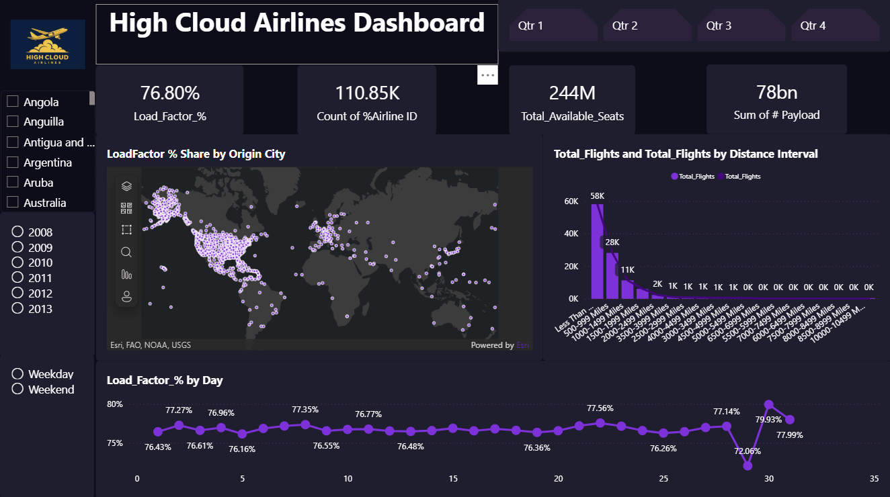
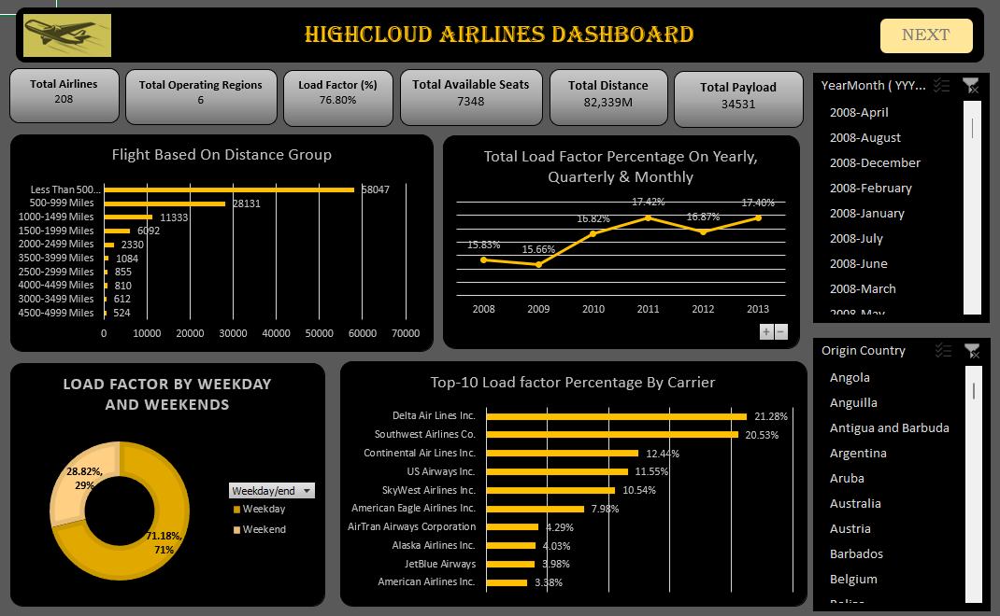
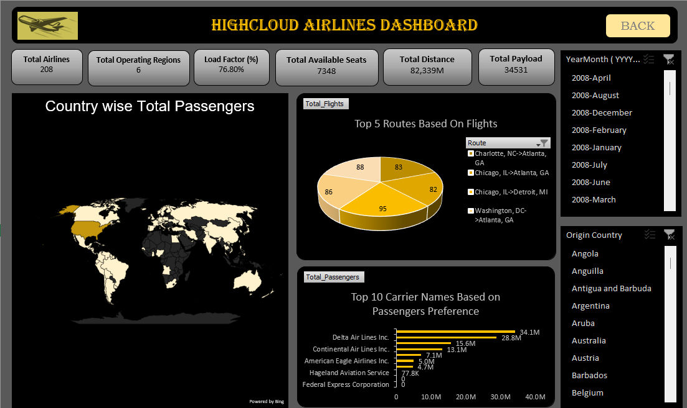

# 🛫 High Cloud Airlines Data Analysis Project  

## 📊 Project Overview  
This project analyzes **airline performance data (2008–2013)** to gain insights into passenger distribution, load factors, carrier performance, and distance-based flight trends.  
The analysis was performed using **Power BI**, **Excel**, **Tableau**, and **MySQL**, with visual dashboards created to highlight key metrics and performance patterns.

---

## 🎯 Objectives  
- To analyze **Load Factor %** trends across years, routes, and carriers.  
- To determine **Top Performing Airlines** and **Routes**.  
- To evaluate **flight frequency by distance groups**.  
- To study performance differences between **Weekdays and Weekends**.  
- To visualize key airline statistics using interactive dashboards.

---

## 🧠 Key Insights  
- **Highest Load Factor:** 2011 (17.21%)  
- **Top Performing Carrier:** Southwest Airlines Co.  
- **Lowest Performing Route:** 47-Mile Mine, AK → Chuathbaluk, AK  
- **Most Frequent Distance Group:** Less Than 500 Miles  
- **Weekday vs Weekend Load Factor:** Weekdays (71.22%) had a higher load factor than weekends (28.78%).  

---

## 🧰 Tools & Technologies Used  
- **Power BI** – Data modeling, DAX measures, visualization  
- **Excel** – Data cleaning, transformation, pivot analysis  
- **Tableau** – Storytelling and interactive charts  
- **MySQL** – Data validation and SQL-based analysis  

---

## 📈 Dashboard Highlights  

### 🔹 **Page 1 – Global and Distance Insights**  

**Includes:**  
- Global Load Factor % by Origin City (Map)  
- Total Flights by Distance Interval  
- Load Factor % by Day (Trend Line)  
- Year, Country, and Weekday/Weekend Filters  

---

### 🔹 **Page 2 – Carrier & Route Performance**  

**Includes:**  
- Total Passengers by Carrier Name  
- Load Factor % by Carrier  
- Total Flights by From–To City (Pie Chart)  
- Weekday vs Weekend Load Factor Share (Donut Chart)  

---

## 🗂️ Dataset Information  
The dataset contains airline operation details such as:  
- **Date, Carrier Name, Transported Passengers, Available Seats, Route, Country, and Distance Group**  
- **Total Records:** 110.85K  
- **Time Period:** 2008–2013  

---

## 📦 Dataset  

Due to GitHub file size limits, raw data files are stored externally.  
📥 You can download them here:  
🔗 [Download Airline Data (Google Drive)](https://drive.google.com/file/d/1eaySPKGNLZIEbA1P1PD_Z_wdvE2Of0aW/view?usp=drive_link)

---

## 👤 Author
**Name:** Pritish Mishra  
**GitHub:** [pritish17-pixel](https://github.com/pritish17-pixel)  
**Role:** Data Analyst Trainee | Data Visualization Enthusiast  

---

⭐ *If you found this project useful, don’t forget to give it a star on GitHub!*
